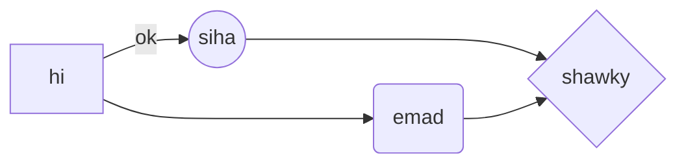
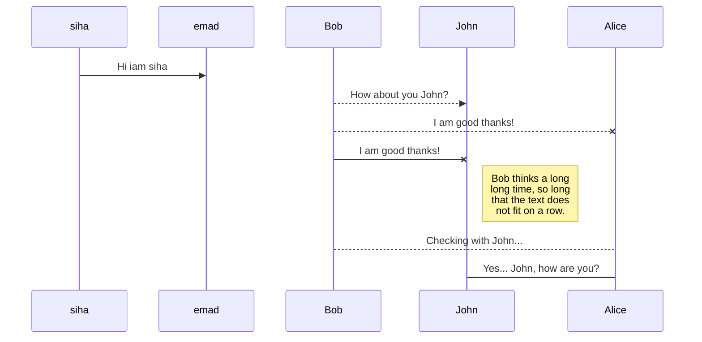

# heading 1
heading 1
=
## heading 2
heading 2
-
### heading 3
#### heading 4
##### heading 5
###### heading 6
---

*italic* text

_italic_ text

**strong** text 

__strong__ text

***strong italic*** text   

___strong italic___ text

~~this is bla bla bla~~

- hi
- hey
- hello
> who am i   
>> i am siha

:smile:
- [x] task 1
- [x] task 2
- [ ] task 3
  - [x] topic 1
  - [ ] topic 2
  - [ ] topic 3

`siha`

<details>
  <summary>hi</summary>
  i am siha
</details>


[hi](https://elzero.org/wp-content/themes/elzero/imgs/home-tracks/python-track.svg "i am siha")


$\Gamma$
$\gamma$

$$hello$$

name|age|gender
   -|-|-
 siha| 20|`male`             
 eamd|45| `male`

    <html></html>
    
```
.box {
color: red;
}
```
    
* web development
  * front end
    * html
    * css
    * js
      * ReactJS
      * AngularJS
      * VueJS
  * back end
* reading
  * book 1
  * book 2
---
- web development
  - front end
    - html
    - css
    - js
      - ReactJS
      - AngularJS
      - VueJS
  - back end
- reading
  - book 1
  - book 2
---
1. web development
     1. front end
        1. html
        2. css
        3. js
           * ReactJS
           * AngularJS
           * VueJS
     1. back end
2. reading
  - book 1
  - book 2
---




